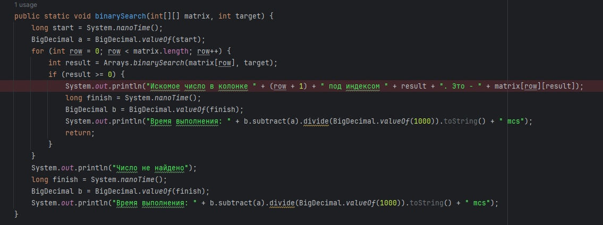
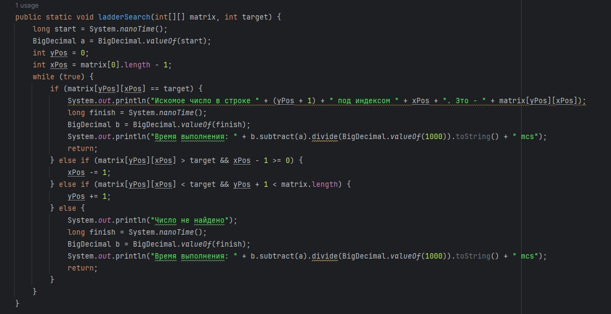
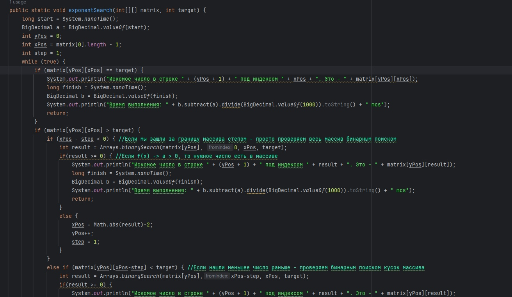
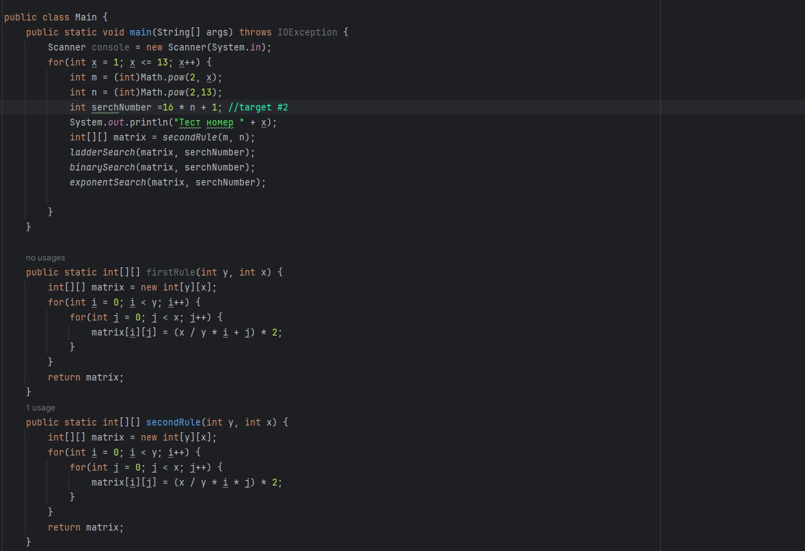
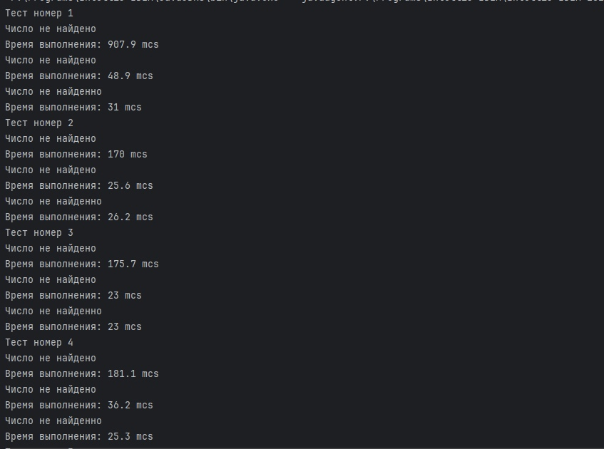
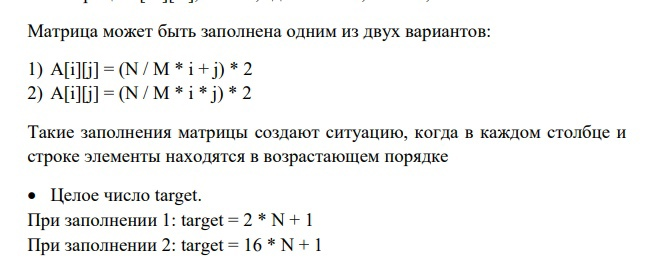
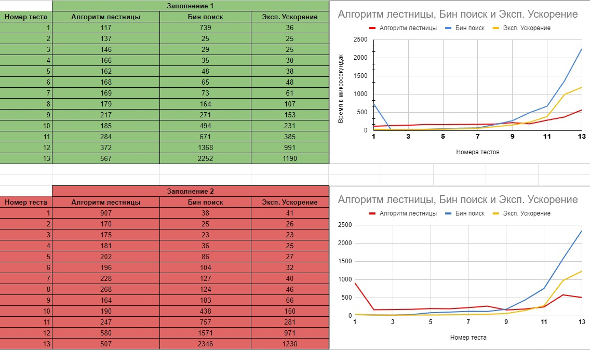

# Algorithms and data structures. Laboratory work № 1
 All this is the first laboratory work on algorithms and data structures. It was prepared and made by Nikitin Arseniy, a student of HSE group 22PE2. Today we will implement the following algorithms on Java, as well as make a comparison of their effectiveness.
- Binary Search 
- Ladder Algorithm 
- Ladder Algorithm with Exponential acceleration.
---
## <b>What we will do?</b>
<b>First, let's take a little look at the algorithms. We'll start with binary search.
Its complexity is O(logN). In the case of the matrix, the speed of operation will be O(log(N) * m) where m is the height at which the target is located. 
The idea of the implementation is to view the matrix from top to bottom and run the search algorithm in turn. When the number is found, the program stops. </b>

## 
<b>The next in line is the Ladder Algorithm. Its complexity is O(N + M) where N and M are the dimensions of the matrix. The idea is to go from the upper right corner to the lower left. 
If the target is larger than the element at the moment - go down, otherwise - to the left.</b>

##

<b>The latter algorithm includes the first two with an additional exponential acceleration. Moving from the upper-right corner to the lower-left corner, we will apply acceleration and binary search by segments. 
Unfortunately, the code is quite cumbersome, so I will attach only a fragment of it. The full version is located in the repository itself. The complexity of this algorithm is approximately equal to O(n * (log(n) - log(m) + 1))</b>

## Okey, let's start.

This is one of the fragments of what the program gave us at the output. The program has derived all 13 tests of the second of the two matrix generation conditions.

Let's put all the data in tables and build graphs. All tests were carried out with measurements in microseconds due to the peculiarities of Java and the convenience of measurements.

As we can see, binary search can lose on large data sizes. This is probably caused by the constant invocation of recursions. And also the need to check each line.
Exponential and ladder algorithms are among the leaders. Everything is ambiguous here. As for big data, the winner in both tests is a primitive ladder search. However, when working with not very large data, binary and exponential search perform much better.

# Conclusion
<b>From this we can conclude that each algorithm under certain conditions can be more efficient than the others. It is necessary to analyze situations competently and choose the right one for work.</b>

And yes, this work is in two languages. In English and Russian.
